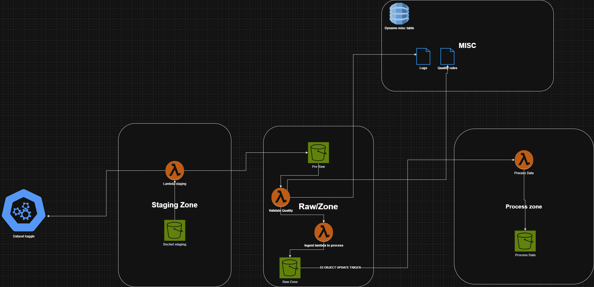

He elegido este dataset([Credit Card Transactions Dataset](https://www.kaggle.com/datasets/priyamchoksi/credit-card-transactions-dataset))porque proporciona una base rica y estructurada para explorar múltiples aplicaciones, desde la detección de fraudes hasta el análisis de comportamiento y predicción financiera. El dataset incluye más de 1.85 millones de transacciones con información como:

* Datos de las transacciones (fechas, montos, categorías).
* Información demográfica de los usuarios (género, ciudad, estado, profesión).
* Datos geoespaciales (latitud, longitud de usuario y comerciante).
* Indicadores de fraude.

La combinación de estos datos permite un análisis integral de los patrones de comportamiento financiero y ofrece un contexto ideal para aplicar técnicas avanzadas de aprendizaje automático, visualización y análisis estadístico.

---

### Objetivo del proyecto

**Caso de uso principal:** Creación de un sistema de detección de fraudes mediante aprendizaje automático.

#### Detalles:

1. **Propósito:** Diseñar y evaluar un modelo predictivo para identificar transacciones fraudulentas.
2. **Metodología:**
   * Análisis exploratorio de datos (EDA) para identificar patrones y correlaciones relevantes.
   * Ingeniería de características para optimizar los datos de entrada al modelo.
   * Implementación de algoritmos de clasificación (como Random Forest, XGBoost o redes neuronales) para detectar fraudes.
   * Evaluación del modelo mediante métricas como precisión, recall y F1-score.
3. **Aplicaciones adicionales:**
   * **Visualización:** Crear dashboards para mostrar estadísticas clave, como tasas de fraude por categoría o región.
   * **Análisis de comportamiento:** Examinar cómo varían los hábitos de gasto entre clientes y detectar anomalías en tiempo real.
   * **Segmentación:** Clasificar clientes según sus patrones de gasto y proporcionar insights accionables para campañas de marketing personalizadas.
4. **Resultados esperados:**
   * Reducción en las tasas de fraude detectado tarde.
   * Herramientas de análisis claras para facilitar la toma de decisiones.
   * Identificación temprana de patrones anómalos.

### Problemas encontrados en los datos:

1. **Valores Faltantes:**

   * La columna `merch_zipcode` contiene valores faltantes (`NaN`), lo que puede afectar el análisis de transacciones relacionadas con ubicaciones.
2. **Problemas de Formato:**

   * La columna `merch_zipcode` está representada como un número decimal (`float64`) en lugar de un entero, lo cual es incorrecto para un campo que representa códigos postales.
   * Las columnas categóricas (`category`, `gender`, `state`) están almacenadas como cadenas (`object`) en lugar de tipos categóricos, lo que puede aumentar el uso de memoria y afectar el rendimiento en cálculos o modelado.
3. **Anomalías Potenciales:**

   * Algunos valores de `merch_zipcode` podrían ser imputados incorrectamente si no se maneja adecuadamente la lógica de imputación, dado que los códigos postales no tienen una relación directa con otros campos numéricos.
4. **Pasos para detectar anomalias:**

   * **Detectar valores faltantes:**
     * Localizar las filas afectadas en `merch_zipcode`.
   * **Imputar valores faltantes:**
     * Usar una estrategia de imputación lógica, como `-1`, si no hay datos adicionales para estimar los valores.
   * **Ajustar formatos:**
     * Convertir `merch_zipcode` a tipo `int64`.
     * Convertir las columnas categóricas (`category`, `gender`, `state`) a tipo categórico.
   * **Revisión final:**
     * Validar la estructura y la consistencia del dataset después de los cambios.

### Diagrama Conceptual del Modelo de Datos

transactions
+---------------------+----------------------------+
| Campo               | Descripción                |
+---------------------+----------------------------+
| transaction_id      | ID único de la transacción |
| trans_date          | Fecha de la transacción    |
| cc_num              | Número de tarjeta          |
| merchant            | Nombre del comerciante     |
| category            | Categoría de la transacción|
| amt                 | Monto de la transacción    |
| merch_zipcode       | Código postal del comercio |
| merch_lat           | Latitud del comerciante    |
| merch_long          | Longitud del comerciante   |
| lat                 | Latitud del usuario        |
| long                | Longitud del usuario       |
| city_pop            | Población de la ciudad     |
| gender              | Género del usuario         |
| is_fraud            | Indicador de fraude        |
| unix_time           | Marca de tiempo en Unix    |
| year                | Año de la transacción      |
| month               | Mes de la transacción      |
| day                 | Día de la transacción      |
+---------------------+----------------------------+

Organización de los Datos
Partición por Año, Mes y Día:

La tabla estará particionada según los campos year, month, y day.
Esto optimiza consultas y actualizaciones relacionadas con períodos de tiempo específicos.
Estructura General:

Cada registro representa una transacción única.
Incluye todos los datos necesarios para análisis geográficos, demográficos y detección de fraude.
Formatos de Datos:

transaction_id: Autogenerado como identificador único.
amt, city_pop, merch_lat, merch_long, lat, long: Numéricos para análisis cuantitativo.
trans_date: Formato DATE para permitir consultas basadas en tiempo.
is_fraud: Booleano para análisis binario.
year, month, day: Derivados de trans_date para la partición.

### Arquitectura propuesta



### **. Captura de Datos (Ingesta)**

* **Fuente inicial** :
* Los datos se obtienen de un dataset público de Kaggle. Esto puede implicar descargar el dataset directamente desde la fuente mediante scripts en Python o usando APIs de Kaggle.
* **Carga inicial en el bucket de Staging (Landing)** :
* Una función **AWS Lambda (Lambda Staging)** se activa para cargar los datos en el **Bucket Staging** (en Amazon S3). Esta función:
  1. Se conecta a Kaggle para descargar los datos.
  2. Los envía directamente al **bucket de Staging Zone** en su formato original (por ejemplo, CSV, JSON, etc.).

---

### **2. Staging Zone (Zona de Aterrizaje)**

* **Propósito** :
* Almacenar los datos crudos recién extraídos en una ubicación segura.
* **Proceso** :
* Los datos son validados superficialmente aquí, por ejemplo, verificando que el formato del archivo sea correcto o que el volumen de datos cumpla con expectativas básicas.
* **Salida** :
* Los datos crudos pasan al bucket de  **Pre Raw Zone** , donde serán sometidos a validaciones más rigurosas.

---

### **3. Raw Zone (Zona de Datos Crudos Validados)**

* **Propósito** :
* Validar y transformar datos crudos, asegurando que cumplan con los estándares de calidad necesarios antes de ser procesados.
* **Procesos en esta zona** :

1. **Validación de calidad** :
   * Una función **AWS Lambda (Validate Quality)** verifica:
   * Datos duplicados.
   * Valores nulos o inconsistentes.
   * Formatos incorrectos.
     * Estas reglas de calidad están almacenadas en **DynamoDB (Quality Rules)** y son ejecutadas por la Lambda.
2. **Almacenamiento Pre Raw** :
   * Los datos que no pasan las validaciones se almacenan en el bucket **Pre Raw** para futuras revisiones o auditorías.
3. **Almacenamiento en Raw Zone** :
   * Los datos validados son transferidos al bucket  **Raw Zone** , que sirve como repositorio central de datos crudos listos para ser procesados.

* **Mecanismo de automatización** :
* Un **trigger de S3** activa la función  **Ingest Lambda to Process** , que transfiere datos desde `Pre Raw` a `Raw Zone` después de la validación.

---

### **4. Process Zone (Zona de Procesamiento de Datos)**

* **Propósito** :
* Transformar los datos validados de `Raw Zone` en datasets procesados y listos para ser consumidos por aplicaciones o herramientas de análisis.
* **Procesos en esta zona** :

1. **Función AWS Lambda (Process Data)** :
   * Realiza transformaciones específicas:
   * Cálculos o agregaciones necesarias para analítica.
   * Limpieza final y ajuste del formato de datos.
   * Integración con lógica empresarial.
2. **Almacenamiento en Process Data** :
   * Los datos procesados son almacenados en un bucket S3 final (`Process Zone`) para ser consumidos por herramientas externas o para análisis posterior.

---

### **5. Administración y Metadatos (MISC)**

* **Propósito** :
* Centralizar logs y reglas de calidad para auditar y supervisar el pipeline.
* **Componentes** :

1. **Logs** :
   * Almacenan información sobre la ejecución de cada función Lambda, errores detectados, y excepciones manejadas.
2. **Quality Rules** :
   * Contienen las reglas de validación utilizadas en `Validate Quality`.
3. **DynamoDB** :
   * Repositorio donde se almacenan configuraciones y metadatos del pipeline.

* **Beneficios** :
* Este enfoque facilita auditorías, debugging y el monitoreo de la calidad de los datos.

### herramientas/servicios

1. **Dataset Kaggle**
   Propósito: Representa la fuente de datos inicial, un conjunto de datos extraído de Kaggle.
   Tecnología: Kaggle es una plataforma reconocida por su repositorio de datasets públicos.
   Justificación: Cumple con el requisito de la prueba técnica de usar datasets públicos y garantiza un punto de partida realista para la extracción de datos. Además, proporciona acceso a datasets con más de 1 millón de filas, como lo solicita la prueba.
2. **Staging Zone**
   Tecnologías utilizadas:
   Amazon S3 (Bucket Staging):
   Propósito: Actúa como una zona de aterrizaje donde los datos crudos se almacenan inicialmente.
   Justificación: S3 es un servicio escalable, económico y confiable para almacenar grandes volúmenes de datos. Su flexibilidad es ideal para gestionar datasets de más de 1 millón de registros.
   AWS Lambda (Lambda Staging):
   Propósito: Una función serverless que se encarga de la ingesta de datos desde Kaggle hacia el bucket de staging.
   Justificación: Lambda permite ejecutar código sin necesidad de gestionar servidores, reduciendo costos y garantizando la escalabilidad. Además, se alinea con la arquitectura moderna de pipelines serverless en AWS.
3. **Raw Zone**
   Tecnologías utilizadas:
   Amazon S3 (Pre Raw y Raw Zone):
   Propósito:
   Pre Raw: Almacena los datos crudos después de una validación inicial de calidad.
   Raw Zone: Contiene los datos que pasan a las siguientes etapas del pipeline.
   Justificación: Similar a la zona de staging, S3 asegura alta durabilidad y bajo costo para almacenar datos en diferentes niveles del pipeline.
   AWS Lambda (Validate Quality e Ingest Lambda to Process):
   Propósito:
   Validate Quality: Ejecuta reglas de calidad de datos, como detección de valores nulos, duplicados, o inconsistencias.
   Ingest Lambda to Process: Transfiere datos validados de Pre Raw a Raw Zone para su procesamiento.
   Justificación: Lambda es idóneo para manejar la validación y transformación inicial de datos debido a su naturaleza event-driven (triggers de S3). Esto también cumple con el enfoque de la prueba técnica para controles de calidad de datos.
4. **Process Zone**
   Tecnologías utilizadas:
   Amazon S3 (Process Data):
   Propósito: Almacena los datos procesados y listos para su uso final (análisis o integración en aplicaciones).
   Justificación: Al igual que en las zonas anteriores, S3 ofrece un espacio seguro y escalable para los datos transformados.
   AWS Lambda (Process Data):
   Propósito: Realiza transformaciones complejas en los datos provenientes de la Raw Zone, aplicando lógica empresarial o preparando datos para análisis.
   Justificación: Lambda simplifica las operaciones de transformación y escalabilidad sin necesidad de administrar infraestructura.
5. **MISC**
   Tecnologías utilizadas:
   Amazon DynamoDB:
   Propósito: Actúa como un repositorio para almacenar reglas de calidad de datos y metadatos relacionados con el pipeline (logs, configuraciones, etc.).
   Justificación: DynamoDB es una base de datos NoSQL que ofrece baja latencia y alta disponibilidad, perfecta para almacenar configuraciones ligeras y logs accesibles rápidamente.
   Logs y Quality Rules (Archivos):
   Propósito: Contienen reglas de validación y logs del proceso ETL.
   Justificación: Se centraliza la trazabilidad y permite auditar el proceso de datos de forma efectiva.
   Por qué estas tecnologías cumplen con los requerimientos de la prueba técnica
   Procesamiento Serverless y Escalable:

La combinación de AWS Lambda y S3 permite manejar cargas de datos masivas (más de 1 millón de filas) sin preocuparse por límites de infraestructura. Este diseño también puede escalar para escenarios como incremento de datos 100x.
Control de calidad de datos:

El uso de Lambda para ejecutar reglas de validación y DynamoDB para registrar reglas y metadatos cumple con el requisito de controles de calidad en el pipeline.
Documentación de arquitectura basada en la nube:

La estructura serverless es ideal para manejar ejecuciones en ventanas específicas (diarias) y ajustarse a necesidades de analítica en tiempo real agregando servicios como AWS Kinesis o AWS Glue si fuera necesario.
Cumplimiento con requerimientos funcionales:

Se utilizan buckets para el almacenamiento en diferentes zonas (Staging, Raw, Process) y funciones Lambda para la ingesta y validación, asegurando reproducibilidad y modularidad.


## como ejecutar ?


Solo lanza el comando 

```
python -m run_etl
```
